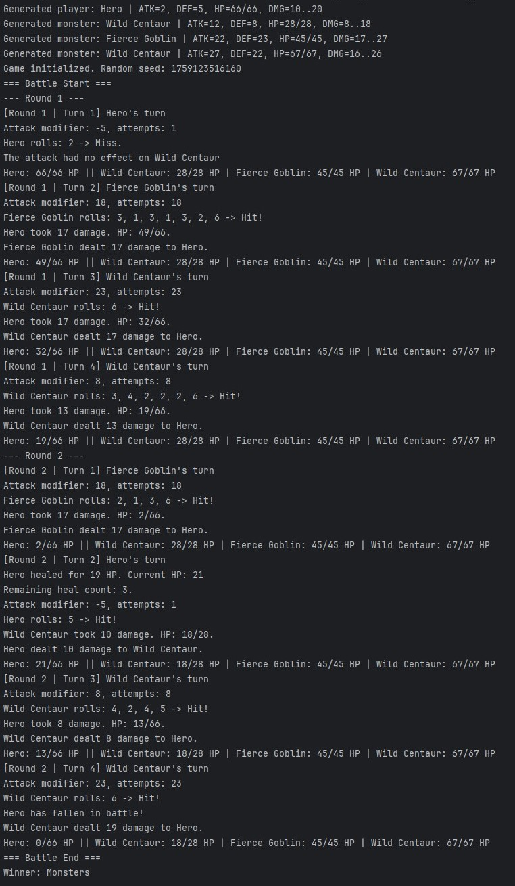

@mind0verflow

## Описание проекта

**HeroVsMonsters** — это небольшая консольная игра на языке **Kotlin**, в которой герой сражается с монстрами.

При запуске игры автоматически создаётся герой и несколько монстров со случайными характеристиками.  
Затем они поочерёдно совершают ходы: герой может атаковать и использовать лечение, а монстры всегда атакуют.  
Бой продолжается до тех пор, пока одна из сторон не одержит победу.  
Игровой процесс полностью автоматизирован и не требует ввода от пользователя.

## Как запустить проект

1. Склонируйте репозиторий:
   ```bash
   git clone https://github.com/ola-vikultseva/HeroVsMonsters.git
   cd HeroVsMonsters
   ```
   
2. Откройте проект в IntelliJ IDEA или другой IDE с поддержкой Kotlin.
3. Найдите файл Main.kt.
4. Запустите функцию main — симуляция боя начнётся автоматически.

## Скриншоты

Пример запуска игры и хода боя в консоли:

